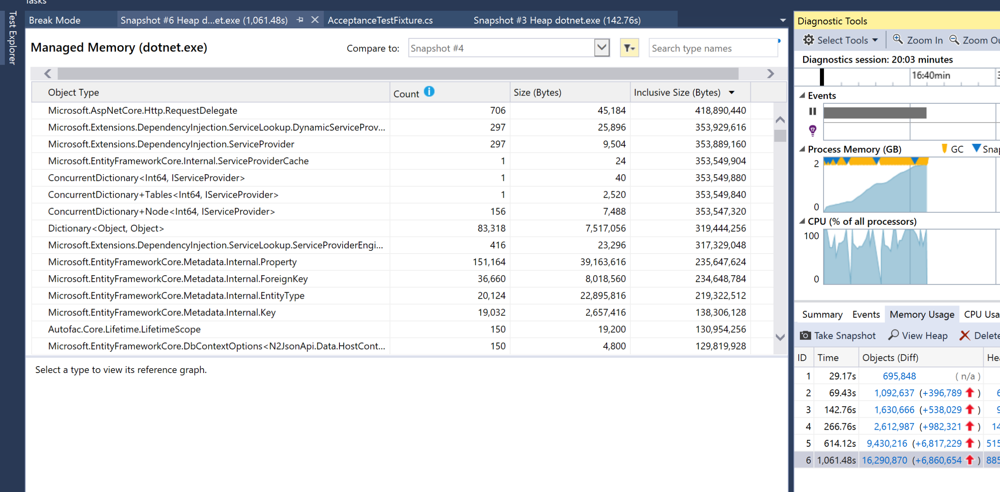
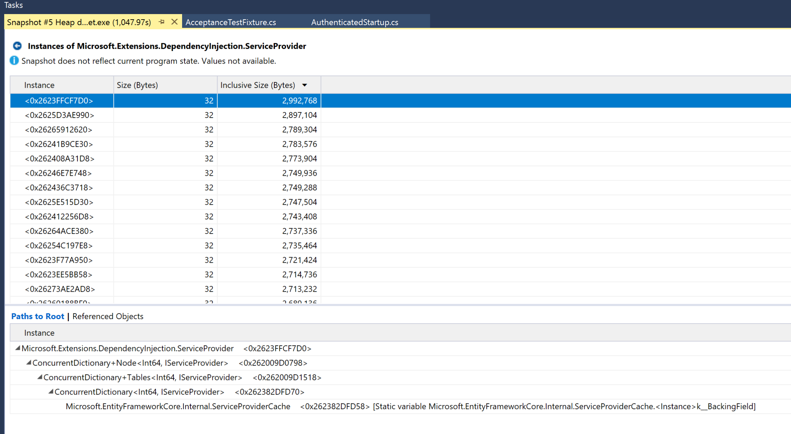
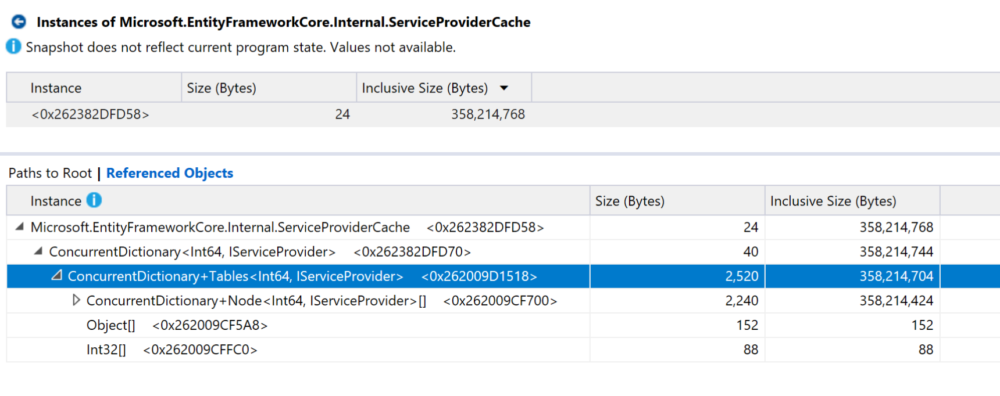
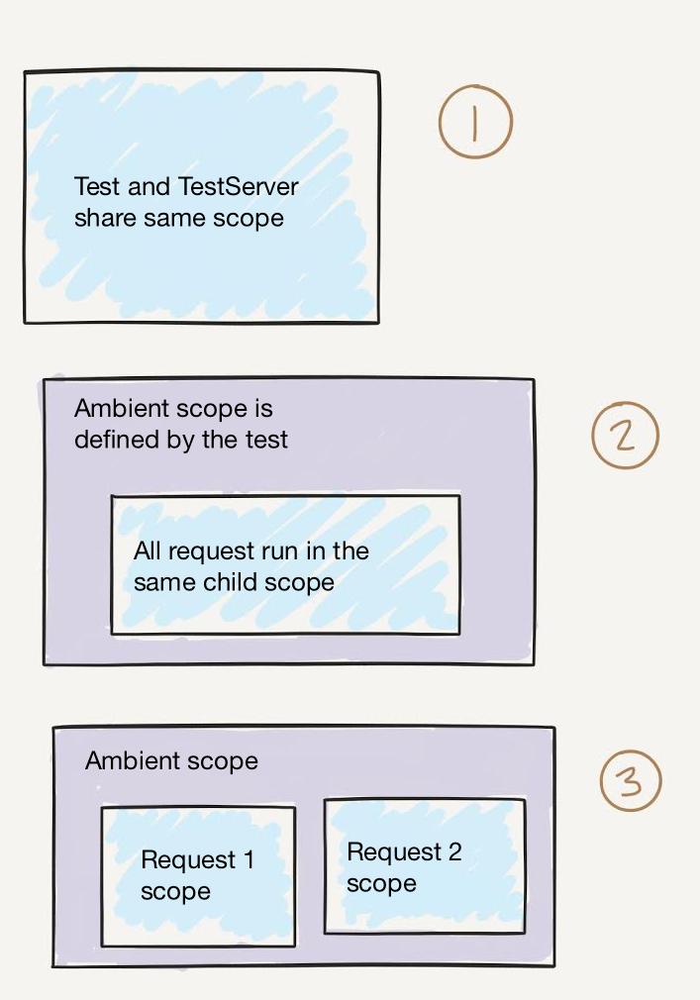

# tl;dr

I've built a library to improve the ergonomics and performance of your ASP.Net Core
integration tests. It allows you to write simple, elegant tests that run against an actual
database but don't need to worry about side-effects. An example test might look like:

```csharp
[Fact]
public async Task Can_Get_All_Articles()
{
    // arrange
    var article = new Article();
    await DbContext.Articles.AddAsync(article);
    await DbContext.SaveChangesAsync();

    // act
    var articles = await GetAllAsync<Article>("articles");

    // assert
    Assert.Single(articles);
}
```

The test runs inside a transaction that gets rolled back when the test completes.
This allows other tests to assume the database is empty.
Management of the `DbContext` and `TestServer` is handled for you by the library.

- [Source Code](https://github.com/jaredcnance/DotnetTestAbstractions)
- [NuGet Package](https://www.nuget.org/packages/DotnetTestAbstractions)

# Intro

[In my last post](https://nance.io/leveling-up-your-dotnet-testing-transactional-integration-testing-in-asp-net-core/)
I showed an approach to using transactions in your ASP.Net Core integration tests.
This allows you to write tests that depend on database state, but do not require you to clean up the
database when you're done.

_I recommend reading [my previous post]((https://nance.io/leveling-up-your-dotnet-testing-transactional-integration-testing-in-asp-net-core/)) for reasons you would use this approach instead of the in-memory database._

I included an example of a `WebFixture` that sets up the `TestServer`,
registers services and creates the `IDbContextTransaction` for each test.
However, we found the performance of this approach became unbearable for a few
hundred tests after upgrading to dotnet core 2 (this included upgrading all the Microsoft.* packages).

I spent a few weeks trying to understand the problem and improve the performance of our tests after the upgrade.
In this post I outline my process and the solution that **reduced test execution time by 93%**.

## Investigating the Problem

My first step was to profile the application and see what was consuming so much time.
I generally do all my work on my MBP, but there aren't any good profilers that I've been able to find for OSX yet.
So, I booted up a [Windows 10 development VM](https://developer.microsoft.com/en-us/windows/downloads/virtual-machines)
using VMWare and then used Visual Studio Community 2017 15.7.2 to start profiling the tests while they ran.

Unfortunately, my initial CPU sampling approach didn't yield much for me to work on.
However, I did notice the test process memory continuing to grow unabated.



What was happening was very similar to the issue described [here](https://github.com/aspnet/EntityFrameworkCore/issues/10535).
EntityFramework's `ServiceProviderCache` was continuing to grow, creating a new `ServiceProvider` per test.



Each `ServiceProvider` gets added to the static [`ServiceProviderCache._configurations`](https://github.com/aspnet/EntityFrameworkCore/blob/e300fdfe4ac314cc9e65520a15b9b7609a6c6a21/src/EFCore/Internal/ServiceProviderCache.cs#L21-L22)
which is persisted across test runs since they all run in the same process (AppDomains do not exist in .Net Core).
So, this `ConcurrentDictionary` continued to grow:



According to [ajvickers](https://github.com/aspnet/EntityFrameworkCore/issues/12440#issuecomment-399158858):

> When AddDbContext is called it ensures certain services used by EF are added to the service provider.
> For example, ILoggerFactory. Since this is done for every context instance, it's equivalent to what is described in #10211.
> Registering the context as a singleton is generally not a good idea even in tests since it should never be registered as singleton in any real app.
> Assuming that you want to keep it this way, probably the best way to tackle this is to take over management of the internal service provider in your tests.
> This will stop EF from building and caching the internal service provider for you.

Okay, so that helps a lot and I now have a much better understanding of what's going on.
From this response I gathered a few things:

1. We don't want to call `AdDbContext` multiple times in the same process for the same `DbContext` implementation.
2. Registering the `DbContext` as a singleton is not ideal.
3. There will be performance consequences if we try to hijack EF's internal service provider.

## Caching Test Servers

So, the very first problem was our fixture was creating a new `TestServer` instance
and calling `AddDbContext` for every test. Based on the information discovered above,
this is a bad idea.

Depending on what version of EF Core you're running, you may even get a nice build warning that
points out the issue:

```
warn: Microsoft.EntityFrameworkCore.Infrastructure[10402]
More than twenty 'IServiceProvider' instances have been created for internal use by Entity Framework.
This is commonly caused by injection of a new singleton service instance into every DbContext instance.
For example, calling UseLoggerFactory passing in a new instance each time--see https://go.microsoft.com/fwlink/?linkid=869049 for more details.
Consider reviewing calls on 'DbContextOptionsBuilder' that may require new service providers to be built.
```

So, the first and most obvious step was to cache our `TestServer` instances.
We wouldn't restart our production web app after each request, so why should we do it in our tests?
The implementation is pretty straightforward, so I'll direct you over to the GitHub repo so you can see it yourself.
I define a [`TestServerCache`](https://github.com/jaredcnance/DotnetTestAbstractions/blob/27851f18f83c234512e492ca5122fcf5b4d54035/src/DotnetTestAbstractions/Fixtures/TestServerCache.cs#L10)
that creates and configures the server and then the fixture [can just fetch it from the cache](https://github.com/jaredcnance/DotnetTestAbstractions/blob/27851f18f83c234512e492ca5122fcf5b4d54035/src/DotnetTestAbstractions/Fixtures/TestServerFixture.cs#L43).

## Sharing Ambient Scope

Now that we're re-using `TestServer` instances, we still need a way to share `DbContext` instances.
And since our previous approach relied on a singleton DI registration, this would mean that every single test would get the same `DbContext` instance which isn't what we want.
The reason we couldn't register it as a scoped service is because the scope is created and disposed during the lifetime of the request.
We need access to the scope before and after the request.

Instead, we have two options:

1. Share the database connection
2. Share the DI request scope

Option 1 would require changing application code to support tests.
It is also a very minimal solution that supports a single use case.
Option 2 would allow us to inspect the state of any scoped service the same way the application code would.
In order to maximize the number of covered use cases and not be required to change application code, I decided to go with #2.

There is an [`IServiceScopeFactory`](https://docs.microsoft.com/en-us/dotnet/api/microsoft.extensions.dependencyinjection.iservicescopefactory?view=aspnetcore-2.1)
interface we can implement to define our our scope for dependency injection. Whenever a service attempts to access the `RequestServices`, the `RequestServicesFeature`
[ensures that an `IServiceScope` exists](https://github.com/aspnet/Hosting/blob/a8c0970cde72242c40534c6c56a99f1d2ee6827a/src/Microsoft.AspNetCore.Hosting/Internal/RequestServicesFeature.cs#L29-L39)
by calling `IServiceScopeFactory.CreateScope()`. Since this was written against an injected interface, we can override the implementation and inject our own `IServiceScopeFactory`.
This would let us create the scope outside of the web request and return the existing scope when the middleware tries to create it.

There are a few requirements of this approach that should be mentioned:
- Our test should create an "ambient scope" that is available to the test and also to the web request.
- The `IServiceScopeFactory` has to be added to the application container.
- Multiple tests should not share an `IServiceScope`.
- When the middleware tries to dispose the scope, it should be a no-op. This allows us to continue using the scope after the request has ended.

In order to satisfy these requirements, I decided to store the scopes in an
[`AsyncLocal`](https://msdn.microsoft.com/en-us/library/dn906268(v=vs.110).aspx) member on the factory.
From the docs:

> **AsyncLocal<T> Class**
> Represents ambient data that is local to a given asynchronous control flow, such as an asynchronous method.

An example implementation might look like:

```csharp
public class AsyncLocalServiceScopeFactory : IServiceScopeFactory
{
    private static AsyncLocal<IServiceScope> _asyncLocalScope = new AsyncLocal<IServiceScope>();

    public IServiceScope CreateScope()
    {
        return (_asyncLocalScope.Value != null)
            ? _asyncLocalScope.Value
            : CreateAmbientScope();
    }

    public static IServiceScope CreateAmbientScope()
    {
        // what now...?
    }
}
```

This would allow us to create the scope ourselves, outside of the web request:

```csharp
var scope = AsyncLocalServiceScopeFactory.CreateAmbientScope();
```

However, we still need to prevent the ASP.Net middleware from disposing our scope.
We can do this by making `IDisposable.Dipose()` a no-op and exposing an `ActuallyDispose()`
method to the test.

```csharp
public class ServiceScope : IServiceScope
{
    public IServiceProvider ServiceProvider { get; }

    public void Dispose() { /* Do nothing 😬 */ }

    public void ActuallyDispose() { /* Dispose of our scope */}
}
```

### Okay, but where does the service lifecycle management take place?

So far we haven't actually resolved any services from this scope and we haven't wired it
up to an actual container so it's pretty much useless right now.
Component/service lifecycle management is not something that I really wanted to roll myself and the
existing types in Microsoft.Extensions.DependencyInjection seem pretty limited.

So, I turned to [Autofac](https://github.com/autofac/Autofac) — a very mature IoC container solution
that provides full support for scopes and nested scopes (something I'll dive into shortly).

Using Autofac, our `AsyncLocalServiceScopeFactory` class becomes:

```csharp
public class AsyncLocalServiceScopeFactory : IServiceScopeFactory
{
    private static AsyncLocal<ServiceScope> _asyncLocalScope = new AsyncLocal<ServiceScope>();
    private static readonly IContainer _container;

    public IServiceScope CreateScope() { /* unchanged */ }

    public static IServiceScope CreateAmbientScope()
    {
        var lifetimeScope = _container.BeginLifetimeScope();
        var scope = new ServiceScope(lifetimeScope);
        _asyncLocalScope.Value = scope;
        return scope;
    }
}
```

I've also passed the Autofac `ILifetimeScope` to the `ServiceScope` implementation which will
resolve services from the scope itself.
It will also dispose the scope when our test calls `ActuallyDispose`:

```csharp
public class ServiceScope : IServiceScope, IServiceProvider
{
    private readonly ILifetimeScope _lifetimeScope;

    public ServiceScope(ILifetimeScope lifetimeScope)
    {
        _lifetimeScope = lifetimeScope;
        ServiceProvider = this;
    }

    public IServiceProvider ServiceProvider { get; }
    public object GetService(Type serviceType) => _lifetimeScope.Resolve(serviceType);
    public void Dispose() { /* Do nothing 😬 */ }
    public void ActuallyDispose() => _lifetimeScope.Dispose();
}
```

At this point the test and the web request share the exact same scope.
This is definitely a step in the right direction and should handle most cases.
However, there are a few cases where this falls short.
For example, the Asp.Net Core Identity `UserStore` [caches entities in the scope](https://github.com/aspnet/Identity/issues/1068).
This would prevent the following test from passing:

```csharp
user.Password = "myNewPassword";
// send a request to update the user's password
await PatchUserAsync(user);
// send a request to login
await PostLoginAsync(user);
```

The reason this fails is because we are deviating a bit from the way ASP.Net Core request scopes should be handled by the application.
In order to better approximate the behavior of an actual web app,
we should give each web request its own scope but still provide access to services registered against the ambient scope.
The below illustration shows the different possibilities.



We have currently implemented scenario 1 and I am in the process of finishing support for scenarios 1-2.
To do this we need to create child scopes (one of the reason I chose AutoFac earlier) that have access to the ambient
scope. One of the challenges here is that if I register a `DbContext` in the ambient scope and in the child scope
(say via a `Startup` class), the child scoped instance would be resolved instead of the ambient instance.

This is one of the challenges I'm currently working on, but for now the current solution should be satisfactory for
at least 95% of use cases.

## So, Where's The Abstraction?

I would love to see this officially supported by Microsoft.
But until then, I have provided a library you can use so you don't need to worry about the details.

- [Source Code](https://github.com/jaredcnance/DotnetTestAbstractions)
- [NuGet Package](https://www.nuget.org/packages/DotnetTestAbstractions)

If you have any questions or are interested in supporting this project, feel free to reach out to me
on Twitter [@jaredcnance](https://twitter.com/jaredcnance).
