> This is a cross-post from [stackify.com](https://stackify.com/net-application-optimization)

## Introduction

It’s Friday afternoon, the majority of the development staff has already packed up and headed home for the weekend, but you remain to see the latest hotfix through to production. To your dismay, immediately after deployment, queues start backing up and you begin to get alerts from your monitoring system. Something has been broken and all evidence points to an application performance bottleneck.

This experience is all too common for developers and software team managers. What can we do to prevent poor performing code from reaching our production environment and bringing our “guaranteed 0% downtime” platform to its knees under the load of production volume? The answer lies in proper pre-production processes that validate our changes have not had substantial negative performance impacts.

In this article, I propose a workflow for measuring performance, diagnosing potential issues, and validating the efficacy of improvements. It’s an iterative process of discovery, profiling, refactoring, testing, benchmarking, and monitoring.

The sample application used in this article can be found on GitHub.

## Code Reviews

Performing code reviews is an essential part of maintaining some quality control over code before it reaches production. Code reviews allow your team members to read through your changes and, using their best judgment, approve or suggest changes to your work. This also helps the entire team keep abreast of all changes that are important to them.

However, code reviews take up time of other engineers and can sometimes be less thorough than desired. The thoroughness of a review is rarely communicated to the team and so an approval can provide a false sense of security that the code is indeed production-ready.

Another failure point is that code reviews rarely include any kind of quantitative feedback. In other words, I can suggest method A will be faster or allocate less than method B, but I am unlikely to take the time to prove the quantitative impact of my assertion.

Finally, things simply get missed. Changes can be made in isolation from the consuming code and a reviewer may not be aware of the context in which a particular set of changes is being executed. For example, adding a simple one-time string concatenation may be fine, but if the consuming code is iterating over the changed code millions of times, then we may have just introduced some significant performance bottleneck.

In summary, code review is an indispensable part of the development process. It aids in maintaining style consistency, knowledge transfer, developer education and overall quality control. But, it should not be viewed as a method for ensuring that the implementation does not have any adverse or out-of-bounds performance impact.

## The Application

The example application used in this blog post can be found on GitHub. It is a simple .NET Core web API application. The focus of this post is on the /people?name={name} route. This request will search our database of People and perform a fuzzy string match on the name, returning the entire list sorted from most to least similar. For the sake of simplicity, we will only implement one matching algorithm: Levenshtein Distance.

I recommend taking a quick look at the GitHub project. The call stack we’ll be focused on looks like:

[PeopleController.GetAsync](https://github.com/jaredcnance/FuzzySearch/blob/e01fd327ea988889b8878a5dbbd699e1c617a4ee/API/Domain/People/PeopleController.cs#L17-L21)
<br />
└── [PersonService.SearchAsync](https://github.com/jaredcnance/FuzzySearch/blob/e01fd327ea988889b8878a5dbbd699e1c617a4ee/API/Domain/People/PersonService.cs#L31-L37)
<br />
　 　 └── Enumerable.OrderBy
<br />
　　　 　 └── [FuzzyComparer.Compare](https://github.com/jaredcnance/FuzzySearch/blob/e01fd327ea988889b8878a5dbbd699e1c617a4ee/API/Services/FuzzyComparer.cs#L20-L35)
<br />
　　　　　 　 └── [LevenshteinFuzzySearch.ComputeSimilarity](https://github.com/jaredcnance/FuzzySearch/blob/e01fd327ea988889b8878a5dbbd699e1c617a4ee/API/Services/LevenshteinFuzzySearch.cs#L16)

## Discovery

Application Performance Management (APM) tools, such as Prefix and Retrace, can be used to identify poorly performing applications at a high level. This investigation enables local discovery of performance issues, and helps us narrow our focus before using a more detailed profiling utility.

### Local Development Environment

In this example, I will use Prefix (a free tool from Stackify) to evaluate the distribution of work. This will help me understand what operations contribute the most to overall response time in the request. Perform these steps to get started.

1.  Install Prefix on Windows
2.  Launch Prefix in your browser by clicking the tray icon
3.  Start the application
4.  Send a request with the search filter applied

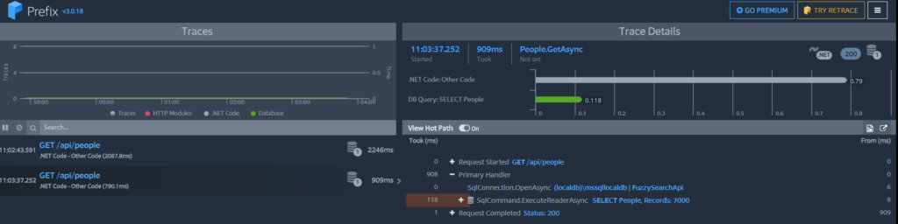

As you can see from the above screenshot, the majority of the work is consumed by our .NET application code while a minor portion is consumed by I/O. From this I can quickly tell that this particular request has a risk of running as slow as 2.2 seconds on the first request and around 900 ms for subsequent requests. This is beyond the threshold of perceived user control. According to [Jakob Nielson](https://www.nngroup.com/articles/powers-of-10-time-scales-in-ux/):

> new pages must display within 1 second for users to feel like they're navigating freely

And it is significantly beyond the 0.1 second threshold of perceived instantaneity.

### Staging Environment

Prefix is a great tool for uncovering errors or performance issues in your local dev environment, but it can be difficult or impractical to reproduce production scenarios locally. Tools like Retrace are excellent at providing these same kind of insights in remotely deployed environments. Retrace will not only help detect production issues, but can also be used to discover issues in a staging environment so that bugs and performance problems are discovered early in the release cycle. Through log management, application monitoring, metrics and alerts you can quickly improve the quality of your release process. Retrace’s [deployment tracking](http://stackify.com/deployment-tracking/) features also enable you to identify performance issues caused by recent changes to application code.

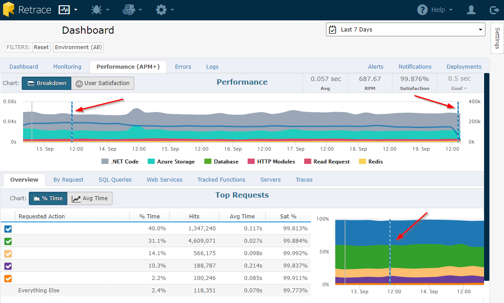

Here is an example of what it looks like in Retrace's performance view (the red arrows are pointing to the deployment markers).

### Profiling

Now that we’ve identified—at a high level—an execution code path of interest, we can dive a little deeper by using a profiler. There are several different profiling options, most of which are personal preference. Visual Studio comes with a Performance Profiler, but there are alternatives such as JetBrains dotTrace and dotMemory. I should mention that the only profiler I was able to get to consistently work with .NET Core was Visual Studio Performance Profiler while debugging. In addition to the debugging profiler, Visual Studio comes with several [other options](https://docs.microsoft.com/en-us/visualstudio/profiling/profiling-feature-tour), most of which do not yet work with .NET Core. For a quick overview of the Visual Studio Profiler, I will defer to [the official documentation](https://docs.microsoft.com/en-us/visualstudio/profiling/beginners-guide-to-performance-profiling#BKMK_External_Code).

Your approach to profiling should probably depend on the application type. For long-running applications with a constant and stable workload, you can sometimes get quick behavioral insights from just the CPU and memory charts. Before I dive into profiling the sample application, I’ll cover two common scenarios you may encounter while profiling.

#### Memory leaks

The first example shows an app that executes a job every few seconds. You can see the memory being consumed by our application is continuing to grow and doesn’t appear to have any correlation to CPU usage. In this particular case, we’re seeing a memory leak where each unit of work in the application is leaking references and so they are not being cleaned up.

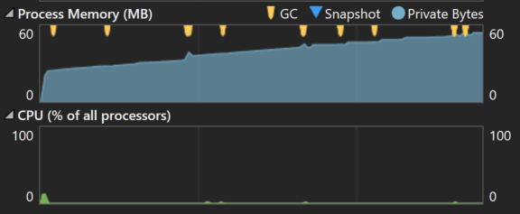

#### Overworked services

The next example shows an unbound and unthrottled event processing application. In other words, it processes real-time events as they occur. We can see that while memory is increasing, so is CPU. This may be an indication that the application is just doing too much work, possibly in parallel. We may need to implement some kind of throttling. That could be an out-of-process mechanism—such as limiting the number of unacknowledged messages that should be delivered to a queue (in the case of AMQP). Or it could be an in-process mechanism—such as using a Semaphore. Or maybe we just need to scale our services to handle the load. But without diving in, there’s not much else we can infer from the graphs.

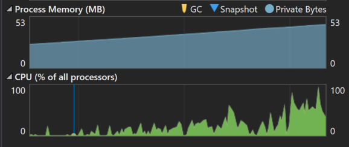

### Sample application results

In our example application, there’s not much we can learn from the graphs themselves. However, since we’ve already identified a particular route of interest, we can set breakpoints to record memory and CPU usage around areas of interest. For this application, I set breakpoints in the service layer to capture the resource consumption of our search service.

Below are the results from profiling the sample application. We can quickly see that we’re spending most of our CPU time in our fuzzy comparison function. This should not surprise us. Looking a little bit deeper we can see that 30% of the time spent within this function is spent in `System.String.Substring(/*...*/)`.

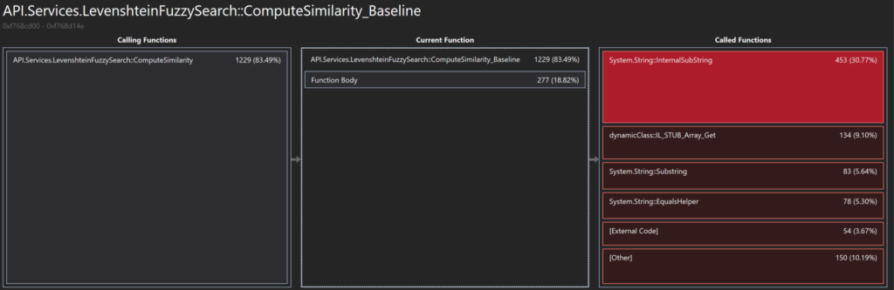

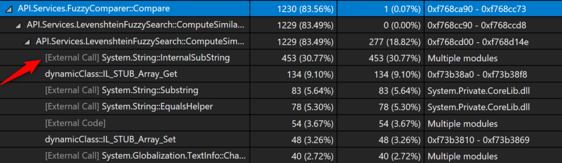

Historically, this wouldn’t have been our first choice for optimization. However, since the introduction of System.Span in C# 7.2, we now have a tool for improving some of these string parsing operations. Now that we have a candidate for optimization, the next step is to write benchmarks against the current implementation so that we can accurately quantify our improvements.

## Benchmarking

Benchmarking is a critical step when making performance improvements. Without it, we have no way to validate the impact of our changes.

### Writing benchmarks

I don’t think there is any argument that the best tool for writing benchmarks for .NET today is [BenchmarkDotNet](https://github.com/dotnet/BenchmarkDotNet). Lots of people are using this tool today including [the AspNetCore team](https://github.com/aspnet/Mvc/blob/bfb5f23647f440e4b83045efe0afc3a234195bdb/benchmarks/Microsoft.AspNetCore.Mvc.Performance/Microsoft.AspNetCore.Mvc.Performance.csproj#L15).

I like to approach benchmarking in a very similar fashion to unit testing. For every project in the solution, I will create a corresponding benchmark project. The benchmark project will mirror the organization of the classes in the project under test. Each benchmark gets prefixed with the name of the system under test (e.g. Foo_Benchmarks.cs). This makes them easier to find later and distinguishable when locating types by name.

### Running benchmarks

A benchmark application is just a console app that calls the benchmark runner. There are two approaches you can use in this entrypoint. The first is by explicitly listing the benchmarks you’d like to run:

```csharp
class Program {
    static void Main(string[] args) {
        BenchmarkRunner.Run<Foo_Benchmarks>();
        BenchmarkRunner.Run<Bar_Benchmarks>();
    }
}
```

The second is a command line switcher that will provide you a prompt to specify the benchmark you’d like to run, assuming one was not provided as an argument. This is particularly useful if your project has a lot of benchmarks since running benchmarks can consume a great deal of time.

```csharp
class Program {
    static void Main(string[] args) {
        var switcher = new BenchmarkSwitcher(new[] {
            typeof(Foo_Benchmarks),
            typeof(Bar_Benchmarks)
        });
        switcher.Run(args);
    }
}
```

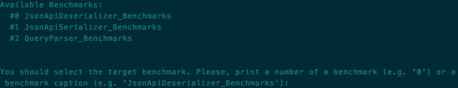

#### Using diagnosers

[Diagnosers](http://benchmarkdotnet.org/Configs/Diagnosers.htm) are one example of customizations you can use to improve your benchmarks. They can be attached to your benchmarks by decorating benchmark classes with attributes. My personal favorite is the `MemoryDiagnoser`, which provides cross-platform allocation and garbage collection detail.

#### Using test data

The setup, teardown and parameter specification for benchmarks has a pretty similar interface to NUnit. You can create Global and Iterative [Setup/Cleanup methods](http://benchmarkdotnet.org/Advanced/SetupAndCleanup.htm).
You can also define compile-time constant parameters as members of the benchmark class or as an enumerable [ParamsSource](http://benchmarkdotnet.org/Advanced/Params.htm#example-paramssource). For non compile-time constants, you will need to implement the IParam interface, which I have done [in the example](https://github.com/jaredcnance/FuzzySearch/blob/e01fd327ea988889b8878a5dbbd699e1c617a4ee/Benchmarks/Services/FuzzySearch_Benchmarks.cs#L43-L54).

There are many more features in BenchmarkDotNet and I highly recommend reading through their [documentation](http://benchmarkdotnet.org/).

#### Example output

The example benchmark uses non compile-time constant parameters to create some random string data to be passed into our distance function. In the example, I generate random strings of lengths 10, 100, 1000, and 10000, and compare each of them against a randomly-generated string of length 100. You can take a look at the generated Markdown results here.


The first observation I would make is that the function’s execution time and allocations are linearly proportional to the size of the query parameter we are provided. What this means is that we have inadvertently created an attack vector for a bad actor. By not truncating the query string value, clients could invoke our API with long query strings in rapid succession. Based on the data, this would likely cause large CPU and memory spikes, potentially degrading our service or forcing us to scale.

The next observation is the memory allocation. In the case of a 1k character string, we will allocate over 6.6 MB just for comparing strings and 66 MB if we get a 10k character string!

## Fixing the Problem

Now that we understand the problem, we can implement a solution and validate the improvement with refactoring, unit tests, and benchmarking.

### The process

Before we start making optimizations, we need to make sure that we have unit tests around the system we intend to affect. Without tests, we may improve performance but we also risk breaking existing functionality. So the iterative process for making performance improvements should look like:

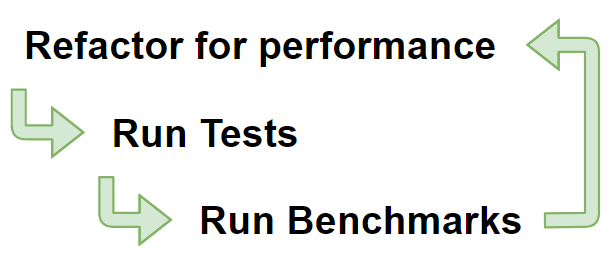

### The solution

In our example application, I’m going to replace
[the use of string.Substring](https://github.com/jaredcnance/FuzzySearch/blob/c91eb96671854502e1150c65e80586c30d9c3856/API/Services/LevenshteinFuzzySearch.cs#L48)
with [the new `Span<T>`](https://github.com/jaredcnance/FuzzySearch/blob/e01fd327ea988889b8878a5dbbd699e1c617a4ee/API/Services/LevenshteinFuzzySearch.cs#L48-L51)
introduced in C# 7.2. For a great introductory on this new type, check out [Jared Parson’s video on Channel 9](https://channel9.msdn.com/Events/Connect/2017/T125).
For a more in-depth look at Span and how you can use it today,
check out [this post by Adam Sitnik](http://adamsitnik.com/Span/#how-to-use-it-today).

`Span<T>` allows us to work with contiguous memory in a type safe way. In the case of string parsing, this means we can iterate over the characters of a string and use an indexer to access characters without allocating a new string – string.Substring allocates new strings everytime.

I recommend taking a look [at the commit](https://github.com/jaredcnance/FuzzySearch/commit/e01fd327ea988889b8878a5dbbd699e1c617a4ee) to see the updated implementation using `Span` instead of `.Substring`. The significant change was from this:

```csharp
var a = str2.Substring(j - 1, 1);
var b = str1.Substring(i - 1, 1);
var cost = (a == b ? 0 : 1);
```

To this:

```csharp
var a = str2.AsSpan().Slice(j - 1, 1)[0];
var b = str1.AsSpan().Slice(i - 1, 1)[0];
var cost = (a == b ? 0 : 1);
```

### Benchmark results

In order to evaluate the efficacy of our changes, we need to re-run our benchmarks against the new implementations, comparing them against the old. To do this, we can temporarily expose the old methods and tell BenchmarkDotNet that it should be our baseline for comparison:

```csharp
[Benchmark]
public int LevenshteinDistance()
=> _levenshteinFuzzySearch.ComputeSimilarity(String1.Value, String2.Value);

[Benchmark(Baseline = true)]
public int LevenshteinDistanceBaseline()
=> _levenshteinFuzzySearch.ComputeSimilarity_Baseline(String1.Value, String2.Value);
```

Now, running our benchmarks against the new and improved code gives us the following results:

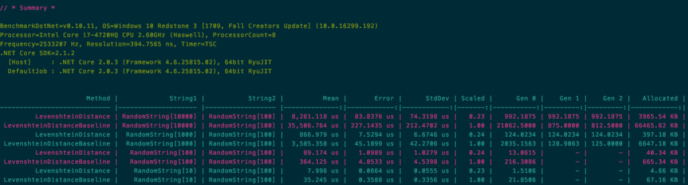

This shows that across the board, execution time decreased approximately 77% and allocations decreased by 94%. So, what does that mean in terms of user response time? Well, let’s take another look at our application in Prefix.

### Prefix and Profiler results

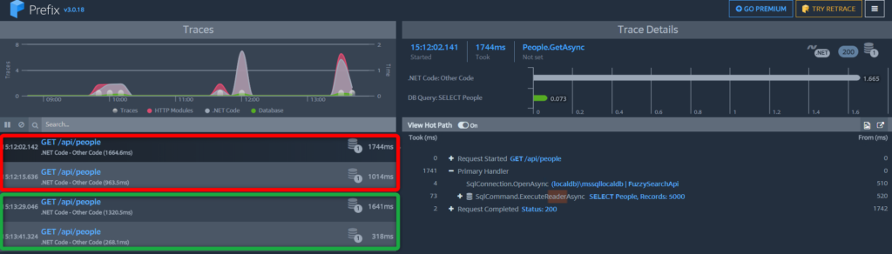

Here you can see both implementations running against the same dataset. We can see a slight improvement over the initial request, but what’s interesting is the 318 ms response time for subsequent requests. We’re now much closer to Nielson’s 0.1s target for perceived instantaneity on a fuzzy search across 5000 records.

If we take a look at the profiler output for the new implementation, we can see how the breakdown has changed.

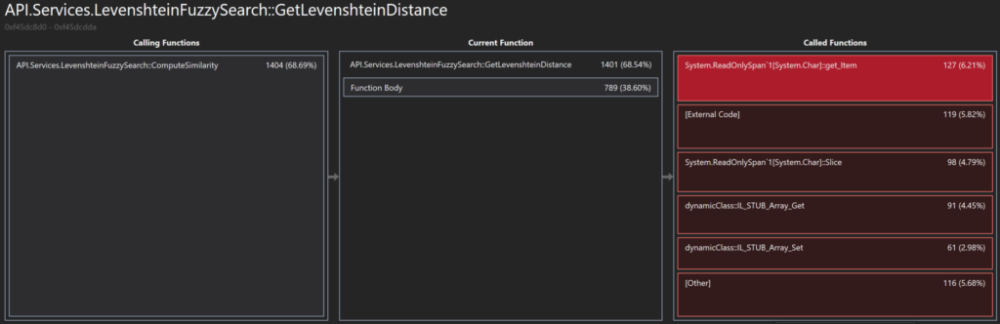

### Common Performance Problems

Here is a short list of a few common application performance problems I’ve encountered in the past:

* Unnecessary collection enumeration and allocation (`.ToList()`)
* String manipulation in loops
* Using `string.Substring()` instead of `Span`
* Using `string.Format` (or C# 6 interpolation via the `$` operator) instead of `string.Concat` for small operations
* Not using async for I/O operations that can be executed in parallel
* Wrapping synchronous operations in async wrappers and executing them synchronously. This results in the creation of unnecessary tasks and state machines.
* Using `List` instead of `Dictionary` for key/id-based access. Or more generalized: choosing improper collection types.
* Unnecessary boxing `(var i = 0; object a = i; var j = (int)a;)`
* Large lock blocks or locking types. Use locks on static instance variables as close as possible to the synchronous operation. Consider the use of ThreadStatic or LocalAsync.

### Conclusion

At the end of the day, the quality of large-scale applications is limited by the quality of the processes that govern their development. Without proper pre-production processes, we will inevitably release poor-performing code to our users. Through the use of pre-production tooling such as Prefix and Retrace on staging environments, we can gain quick insights into the performance impact of changes. Once we have identified possible issues, we can follow the procedure outlined above to correct performance problems before they bring down critical systems.

If you found this post helpful or if you have any questions, let me know in the comments!

### Additional Resources

* [BenchmarkDotNet](http://benchmarkdotnet.org/)
* [Profile application performance in Visual Studio](https://docs.microsoft.com/en-us/visualstudio/profiling/beginners-guide-to-performance-profiling)
* [dotMemory](https://www.jetbrains.com/dotmemory/) | [dotTrace](https://www.jetbrains.com/profiler/) from JetBrains
* [Microsoft PerfView](https://github.com/Microsoft/perfview)
* [Writing High-Performance .Net Code](http://www.writinghighperf.net/buy/) by [Ben Watson](https://twitter.com/benmwatson)
* [Corestart 2.0: What's new for performance in .NET Core 2.0](https://www.ageofascent.com/2017/11/05/perfromance-dotnet-core-2-corestart-conference/) by [Ben Adams](https://twitter.com/ben_a_adams)
