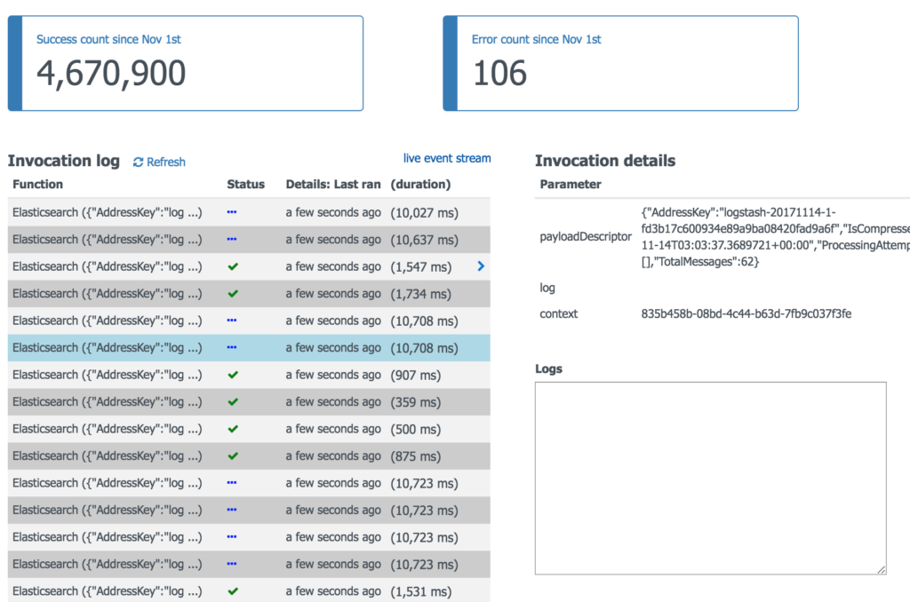
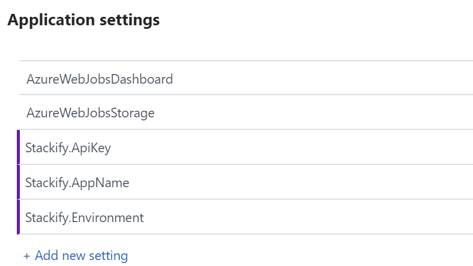

> This is a cross-post from [stackify.com](https://stackify.com/logging-azure-functions)

If you are thinking about using Azure Functions, at some point you will be confronted with the challenge of figuring out how application logging works.
Logging in Azure Functions has some unique challenges due to the stateless nature of the serverless execution model.
In this article, we will cover some basics about Azure Functions and provide instruction on how to write application logs.

You can check out the final solution [here](https://github.com/jaredcnance/AzureFunctionsLogging).

## Serverless 101

Azure Functions is one implementation of the serverless execution model.
Serverless compute platforms such as Azure Functions, AWS Lambda and Google Cloud Functions represent possibly the most significant change in how
application code is managed and executed since the rise of web applications.

The idea is that we deploy our application code to a platform.
This platform bundles together the infrastructure and runtime framework responsible for hosting and invoking our application.
Technologies have existed that provide some of these features for web applications already (Azure App Service, Heroku, etc.).

The main difference here is a common pattern for application development that is agnostic to how the application is invoked (HTTP request, timer, queue message, etc.).
Azure Functions supports many different types of triggers, not just HTTP requests.

### Infinite scale

Possibly the primary highlight of serverless is the ability to quickly scale up and down based on the demand.
We are no longer paying for a set of VMs constantly running whether they are being fully utilized or not.
This allows us to improve our utilization efficiency, paying only for what is used.

### Stateless

Serverless applications are

> run in stateless compute containers that are event-triggered, ephemeral
> (may only last for one invocation), and fully managed by a 3rd party”
> [Fowler](https://martinfowler.com/articles/serverless.html).

Note that .Net Azure Functions are only semi-stateless.
For performance reasons, there is no app domain isolation between functions within the same function app.
This means statics are persisted across invocations until the app domain is unloaded.

### Ultimate simplicity (sometimes)

Serverless solutions such as Azure Functions are growing in popularity because of their promised simplicity.
You can just write all your code in your browser, right?
I’m being facetious here — this strategy is unlikely to scale well for applications of even moderate complexity.
However, while more things have been built into the framework and we can be concerned with less, this technology
is very young and concerns that have been historically trivial with “first-class” applications require a bit more work.
A good example of this is application logging.

## History of Logging in Azure Functions

The first logging mechanism available in Functions was through the `TraceWriter` class. You can accept a `TraceWriter` instance as a parameter in your function method.

```csharp
public static void Run(Message message, TraceWriter log)
{
  log.Info("Function invoked.");
  // ...
}
```

The `TraceWriter` will make logs available through the “Invocation log” in the portal and the command line when debugging with [func.exe](https://github.com/Azure/azure-functions-cli).
You can also view these logs in Kudu or as the raw data stored in Table Storage under the storage account configured using the `AzureWebJobsStorage` setting.



## Current State

The problem with `TraceWriter` is that it is only useful for applications being executed by the Azure Functions runtime.
So we don’t want all of the classes in our application to be tightly coupled to `TraceWriter`.
We want to have the ability to reuse the classes in other applications such as web or console apps.

The best that we get is a minor abstraction of `TraceWriter` in the form of the `ILogger` interface.
You may recognize this as the interface introduced in ASP.NET Core through the Microsoft.Extensions.Logging.Abstractions package.
An example function using the ILogger interface looks like:

```csharp
public static void Run(Message message, ILogger log)
{
  log.LogInformation("Function invoked.");
  // ...
}
```

Unfortunately, [we are not provided any mechanism](https://social.msdn.microsoft.com/Forums/en-US/10f139b2-8964-4487-b11f-6c74c891eeb5/using-custom-ilogger-in-azure-functions?forum=AzureFunctions)
to access the `ILoggerFactory` instance that creates the loggers.
This means we need to create an implementation of the [Adapter pattern](https://dotnetcodr.com/2013/04/25/design-patterns-and-practices-in-net-the-adapter-pattern/)
so that our service code does not depend on the concrete `TraceWriter` type.

## log4net

See the full example implementation here. Some of the code below has been simplified to improve readability.

Azure Functions does not load configuration from an app.config or web.config file. So the only way that we have to
specify our log4net configuration is through a [separate config file](https://logging.apache.org/log4net/release/manual/configuration.html#dot-config),
as shown by an example in the [repository](https://github.com/jaredcnance/AzureFunctionsLogging/blob/master/AzureFunctionsLogging/Log4net/Log4Net.config).
Now you can load the configuration file:

```csharp
private static string _functionDirectory;

public static async Task<HttpResponseMessage> Run(HttpRequestMessage req, TraceWriter log)
{
  var stackifyAppender = new StackifyAppender();
  stackifyAppender.ActivateOptions();
  log4net.Config.BasicConfigurator.Configure(stackifyAppender);
  // ...
}
```

Now create an adapter for the logging interface of our choice.
The adapter interface can be Microsoft’s ILogger, or log4net’s ILog, or whatever interface you have chosen for the rest of your stack.
An example implementation using the log4net ILog interface [is here](https://github.com/jaredcnance/AzureFunctionsLogging/blob/master/AzureFunctionsLogging/Log4net/ILogTraceWriterAdapter.cs).

You may notice that we need to have a type definition to create our logger.
The logging adapter needs to know the type that will be receiving the adapter instance.
In exceptionally simple functions, you can keep it simple and manually construct your dependency graph on invocation:

```csharp
var logger = new ILogTraceWriterAdapter(typeof(Function), log);
var processor = new FunctionProcessor(logger);
processor.Process(body);
```

### Injecting the Logger

However, for more complex applications, you can use [dependency injection](http://stackify.com/net-core-dependency-injection/) (DI) to handle injection of your logger.
Since the Azure Functions runtime [ships with Autofac](https://github.com/Azure/azure-webjobs-sdk-script/blob/bac0a62e9a4f844c95dd2ffbbd5702cd5cab30d0/src/WebJobs.Script.WebHost/WebJobs.Script.WebHost.csproj#L35)
included, it makes sense for us to use that as the DI framework.
Autofac provides dynamic component resolution hooks so that we can provide the type definition to the consuming logger.
[In the example](https://github.com/jaredcnance/AzureFunctionsLogging/blob/master/AzureFunctionsLogging/Log4net/TraceWriterLoggingModule.cs), I do the following:

```csharp
private void OnComponentPreparing(object sender, PreparingEventArgs e)
{
  e.Parameters = e.Parameters.Union(new[] {
    new ResolvedParameter(
      (p, i) => p.ParameterType == typeof(ILog),
      (p, i) => new ILogTraceWriterAdapter(p.Member.DeclaringType, e.Context.Resolve<TraceWriter>())
    ),
  });
}
```

Any service that is resolved from the Autofac container and requires an implementation of `ILog` will receive an instance of `ILogTraceWriterAdapter`.
Autofac constructs the adapter using the requesting type and registered `TraceWriter` instance.
We also need to create a container and register our instances to that container:

```csharp
var builder = new ContainerBuilder();
builder.RegisterModule<TraceWriterLoggingModule>();
builder.RegisterType<FunctionProcessor>();
var container = builder.Build();
```

Now add the `TraceWriter` to the container by [creating a scope](https://github.com/jaredcnance/AzureFunctionsLogging/blob/master/AzureFunctionsLogging/Log4net/Function.cs#L23-L27):

```csharp
using (var scope = _serviceProvider.BeginLifetimeScope(b => b.RegisterInstance(log)))
{
  var processor = scope.Resolve<FunctionProcessor>();
  processor.Process(body);
}
```

## Serilog

Luckily, in the case of Serilog, there is already a sink
([Serilog.Sinks.AzureWebJobsTraceWriter](https://github.com/StarRez/Serilog.Sinks.AzureWebJobsTraceWriter)) built exactly for this purpose.

```csharp
using Serilog.Sinks.AzureWebJobsTraceWriter;

var log = new LoggerConfiguration()
 .WriteTo.TraceWriter(traceWriter)
 .CreateLogger();

log.Warning("This will be written to the TraceWriter");
```

You can then inject the log instance into the scope in the same way that I demonstrated above with log4net.

## Other Providers

While there are many other logging providers that are not covered here,
I believe that I have equipped you with the tools that you will need to implement logging for the other providers.

## Stackify

If you would like to ship your Azure Functions logs to Stackify (and we hope you do!), we recommend using one of our extensions to the major logging frameworks.
Also, the [demo repository](https://github.com/jaredcnance/AzureFunctionsLogging/blob/dee58c441216778a2ed205d1aebcaeb9334708bd/AzureFunctionsLogging/)
provides examples for shipping log4net and Serilog logs to Stackify.

> Tip: When you are hacking around with a new app and trying to send logs to Stackify, try
> filtering down to the function app and use the log tailing feature so you can see the logs as they are processed by Stackify.

### Configuration

I used the [Microsoft.Extenstions.Configuration](https://github.com/jaredcnance/AzureFunctionsLogging/blob/dee58c441216778a2ed205d1aebcaeb9334708bd/AzureFunctionsLogging/AzureFunctionsLogging.csproj#L12-L13)
packages to [load configuration](https://github.com/jaredcnance/AzureFunctionsLogging/blob/dee58c441216778a2ed205d1aebcaeb9334708bd/AzureFunctionsLogging/Log4net/ServiceProvider.cs#L10-L16)
from environment variables and pass them to the [Stackify library](https://github.com/stackify/stackify-api-dotnet):

```csharp
private static readonly IConfigurationRoot _config = new ConfigurationBuilder().AddEnvironmentVariables().Build();
static Function() {
  _config.ConfigureStackify();
}
```

Configuration from `local.settings.json` will be available during development. For deployed functions, you can apply settings through the portal:

Configuration from local.settings.json will be available during development. For deployed functions, you can apply settings through the portal.



## Future

Whatever solution that you choose (at this time) will contain some temporary stopgap measure(s) until there is a formalized solution for dependency injection.
This may involve some effort to reuse prior art introduced in ASP.NET Core. Until then, we’ll be tracking the progress at
[Azure/azure-webjobs-sdk-script#1579](https://github.com/Azure/azure-webjobs-sdk-script/issues/1579).

The best advice that I can give at this point is to ensure that your service code is dependent on the `ILogger` interface or some other abstraction that you may define,
but not `TraceWriter` . Eventually we should be able to pull back the adapters introduced above and use a proper DI-based logging solution.

## Possible Issues

* “Exception while executing function: Functions.log4net -> Exception binding parameter ‘log’ -> No value was provided for parameter ‘log’.”

* This can be caused by a version mismatch.
  The function runtime is bringing in Microsoft.Extensions.Logging at v1.1.1
  and you may be referencing a different version.

* You may run into an issue accepting ILogger as a function method parameter
  that causes log messages to not be displayed in the console when running the
  function locally using func.exe. As of the writing of this post, there has yet
  to be any resolution [from the Azure Functions team](https://github.com/Azure/azure-functions-cli/issues/130).

* Depending on which version of func.exe you are running,
  you may run into issues trying to use the pre-release (3.0.0-_)
  Microsoft.Azure.WebJobs._ packages.
  For example, I’m running Azure Functions Core Tools (1.0.4)
  and Function Runtime Version: 1.0.11232.0, which references
  Microsoft.Azure.WebJobs 2.1.0. Since [binding redirects are still unsupported](https://github.com/Azure/azure-webjobs-sdk-script/issues/992),
  this means there will be runtime type errors when trying to reference types in the pre-release version.

## Resources

* [Pre-compiled Azure functions](https://github.com/Azure/azure-webjobs-sdk-script/wiki/Precompiled-functions)
* [Dependency injection](http://stackify.com/net-core-dependency-injection/)

## GitHub Issues To Watch

* [Binding redirect support](https://github.com/Azure/azure-webjobs-sdk-script/issues/992)
* [Allow custom dependency injection](https://github.com/Azure/azure-webjobs-sdk-script/issues/1579)
* [Logging written to ILogger does not appear in the CLI](https://github.com/Azure/azure-functions-cli/issues/130)
* [In-memory integration testing of Azure functions](https://github.com/Azure/azure-webjobs-sdk/issues/1390)
