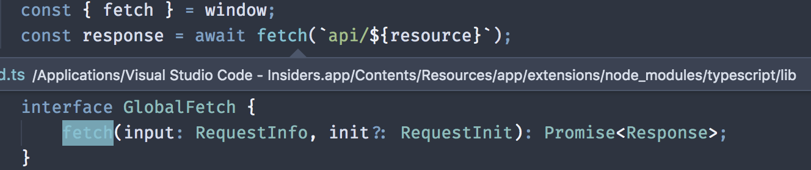

> This is a cross-post from [stackify.com](https://stackify.com/typescript-vs-javascript-migrate/)

TypeScript (TS) and JavaScript are two widely known languages in the development world, but what are the differences and what use cases are better suited for one over the other? In this post, we’ll compare the two languages, how they relate to one another, discuss their primary differences, and outline the benefits of each.

### Defining TypeScript

[JavaScript](https://en.wikipedia.org/wiki/JavaScript) is a dynamic, weakly-typed scripting language built for the web. It enables developers to add interactive functionality to their web pages without requiring unnecessary server-side processing. During [HTML parsing](https://html.spec.whatwg.org/multipage/scripting.html#script), script files are downloaded and executed within the user's browser rather than on your application server.

[TypeScript](https://www.typescriptlang.org/) is an [open source](https://github.com/Microsoft/TypeScript) syntactic superset of JavaScript that uses a [compiler](https://www.npmjs.com/package/typescript-compiler) to produce JavaScript (EcmaScript 3+). TypeScript offers type annotations which provide optional, static type checking at compile time. Since TypeScript is a superset of JavaScript, all JavaScript is syntactically valid TypeScript. However, that does not mean all JavaScript can actually be processed by the TypeScript compiler:

```js
let a = 'a'
a = 1 // throws: error TS2322: Type '1' is not assignable to type 'string'.
```

### Benefits of TypeScript

#### Type Annotations

TypeScript [was created to](https://github.com/Microsoft/TypeScript/wiki/TypeScript-Design-Goals) "statically identify constructs that are likely to be errors". This allows us to make safe assumptions about state during execution. Let's compare the following JavaScript and TypeScript functions:

```javascript
// JavaScript
function getPassword(clearTextPassword) {
  if (clearTextPassword) {
    return 'password'
  }
  return '********'
}

let password = getPassword('false') // "password"
```

Nothing in JavaScript will prevent a script from calling `add(...)` with invalid parameters which will result in a **silent error** at runtime. This can be entirely avoided **at compile time** using TypeScript's type annotations:

```typescript
// TypeScript
function getPassword(clearTextPassword: boolean): string {
  if (clearTextPassword) {
    return 'password'
  }
  return '********'
}

let password = getPassword('false') // throws: error TS2345: Argument of type '"false"' is not assignable to parameter of type 'boolean'.
```

This contrived example demonstrates how we can prevent operations from acting on objects of an unexpected type. Historically, one of the biggest complaints of JavaScript was the difficulty in tracking down issues because of the lack of type checking combined with things like [type coercion](https://github.com/getify/You-Dont-Know-JS/blob/master/types%20%26%20grammar/ch4.md#chapter-4-coercion) which may cause undesired results for those who aren't familiar with JavaScript intricacies.

#### Type-based Language Features

In addition to static type analysis, TypeScript also adds the following features to JavaScript:

* [Interfaces](https://www.typescriptlang.org/docs/handbook/interfaces.html)
* [Generics](https://www.typescriptlang.org/docs/handbook/generics.html)
* [Namespaces](https://www.typescriptlang.org/docs/handbook/namespaces.html)
* [Null checking](https://www.typescriptlang.org/docs/handbook/release-notes/typescript-2-0.html)
* [Access Modifiers](https://www.typescriptlang.org/docs/handbook/classes.html)

#### External API Documentation

Suppose the above `getPassword(...)` function belonged to an external library. How would I, as a consumer of that library, know the type to pass into the function? There are [jsdoc comments](http://usejsdoc.org/) that many IDEs and editors, such as [VSCode](https://github.com/Microsoft/TypeScript/wiki/JavaScript-Language-Service-in-Visual-Studio#JsDoc) support. Then there is the library's own documentation, which are tools like [Dash](https://kapeli.com/dash) make more accessible. But none of these provide the kind of experience offered by TypeScript out of the box.

Consider the [fetch API](https://developer.mozilla.org/en-US/docs/Web/API/Fetch_API) as an example. The following screenshot demonstrates how we can explore the API using the [VSCode Peek Definition](https://code.visualstudio.com/docs/editor/editingevolved#_peek) feature. Using these tools we can quickly discover the input parameter types (`RequestInfo` and `RequestInit`) and the return type (`Promise<Response>`). These kind of tools go well beyond what is available through classic JavaScript and jsdocs.



### Misconceptions

There are many misconceptions around why someone might choose TypeScript. I've cherry-picked a few to discuss here.

* **ES6 Features**:
  One of the most common reasons for choosing TS is the desire to use ES6 features like modules, classes, arrow functions, [and others](http://es6-features.org/). However, this is not a good reason for choosing TypeScript since the same thing can be achieved using [Babel](https://babeljs.io/). In fact, it is not uncommon to see TypeScript and Babel used in the same application.

* **It's Easier Than JavaScript**:
  For the most part this statement is subjective but there are valid arguments that TS introduces [syntax noise](https://martinfowler.com/bliki/SyntacticNoise.html). The most important thing however, is that TS does not hide JS. It is not an excuse for disregarding JavaScript fundamentals. TS is still a superset of JavaScript and does not provide protection from many of the common complaints against JavaScript which are unrelated to the lack of static type checking ([this](https://github.com/getify/You-Dont-Know-JS/blob/master/this%20%26%20object%20prototypes/ch1.md#confusions), [scopes](https://github.com/getify/You-Dont-Know-JS/tree/master/scope%20%26%20closures), [prototypes](https://github.com/getify/You-Dont-Know-JS/blob/master/this%20%26%20object%20prototypes/ch5.md), etc.). Because of this, developers should still maintain strong JS competence.

* **Type Correctness == Program Correctness:**
  While this may seem like an obviously incorrect statement, I believe static type checking provides an artificial safety net that developers can take for granted and is worth discussing. If type correctness does not imply program correctness, then what can we do to continually and repeatably ensure our program does what we intend? The best answer I'm aware of is unit testing. So, it begs the question that if we intend to prove our program is correct through unit tests, these tests _should_ also prevent most type errors.

* **Static Typing Gives You Tree-Shaking:**
  [Tree shaking](https://webpack.js.org/guides/tree-shaking/) refers to dead-code elimination through the use of static constructs like named module `import`/`export` and `const`. TypeScript does not [currently support](https://github.com/Microsoft/TypeScript/issues/8) tree-shaking out of the box.

### Syntax and Compilation Comparison

It is common to hear developers choosing TypeScript because of features like modules and classes. However, it is important to understand these features are also available in JavaScript since ES6 and you can use [Babel](https://babeljs.io/) to transpile down to ES5 for greater [browser compatibility](https://caniuse.com/#search=es6). Because of this confusion, here is a quick syntax comparison for some of the more recent EcmaScript features. For each feature, you'll find the TypeScript version and its compiled ES5 JavaScript along with the dynamic ES6 definition transpiled to ES5 using babel.

#### Classes

```ts
// -- TypeScript -- //
class Article {
  name: string
  constructor(name: string) {
    this.name = name
  }
}

// -- ES5 (using TS compiler) -- //
var Article = /** @class */ (function() {
  function Article(name) {
    this.name = name
  }
  return Article
})()
```

```js
// -- ES6 -- //
class Article {
  constructor(name) {
    this.name = name
  }
}

// -- ES5 (using babel) -- //
;('use strict')

function _classCallCheck(instance, Constructor) {
  if (!(instance instanceof Constructor)) {
    throw new TypeError('Cannot call a class as a function')
  }
}

var Article = function Article(name) {
  _classCallCheck(this, Article)

  this.name = name
}
```

#### Modules

```ts
// -- TypeScript -- //
export default class Article {}

// -- ES5 (using TS compiler) -- //
define(['require', 'exports'], function(require, exports) {
  'use strict'
  Object.defineProperty(exports, '__esModule', { value: true })
  var Article = /** @class */ (function() {
    function Article() {}
    return Article
  })()
  exports.default = Article
})
```

```js
// -- ES6 -- //
export default class Article {}

// -- ES5 (using babel) -- //
;('use strict')

Object.defineProperty(exports, '__esModule', {
  value: true,
})

function _classCallCheck(instance, Constructor) {
  if (!(instance instanceof Constructor)) {
    throw new TypeError('Cannot call a class as a function')
  }
}

var Article = function Article() {
  _classCallCheck(this, Article)
}

exports.default = Article
```

#### Optional Parameters

```ts
// -- TypeScript -- //
function log(message: string = null) {}

// -- ES5 (using TS compiler) -- //
function log(message) {
  if (message === void 0) {
    message = null
  }
}
```

```js
// -- ES6 -- //
function Log(message = null) {}

// -- ES5 (using babel) -- //
;('use strict')

function Log() {
  var message =
    arguments.length > 0 && arguments[0] !== undefined ? arguments[0] : null
}
```

### When To Choose:

#### TypeScript

* **Working with a New Library or Framework:**
  Let's suppose you're taking up React for a new project. You are not familiar with React's APIs, but since they offer [type definitions](https://www.npmjs.com/package/@types/react), you can get intellisense that will help you navigate and discover the new interfaces.

* **Prefer Compile Time Type Checking**: It is entirely possible to perform runtime type verification using vanilla JavaScript. However, this introduces additional runtime overhead that could be avoided by performing compile-time validation

* **Large Projects or Multiple Developers:**
  TypeScript makes the most sense when working on large projects or you have several developers working together. Using TypeScript's interfaces and access modifiers can be invaluable in communicating APIs (which members of a class are available for consumption).

#### JavaScript

* **Build Tools Required:** TypeScript necessitates a build step to produce the final JavaScript to be executed. However, it is becoming increasingly rare to develop JavaScript applications without build tools of any kind.
* **Small Projects:** TypeScript may be overkill for small teams or projects with a small code surface area.
* **Strong Testing Workflow:** If you have a strong JavaScript team who is already implementing test-driven development, switching to TypeScript may not give you enough to make it worth the associated costs.
* **Added Dependencies:** In order to use libraries with TS, you will need their type definitions. Every type definition means an extra npm package. By depending on these extra packages you are accepting the risk that these may go un-maintained or may be incorrect. If you choose not to import the type definitions, you are going to lose much of the TS benefit. Note that the [DefinitelyTyped](https://github.com/DefinitelyTyped/DefinitelyTyped) project exists to mitigate these risks. The more popular a library is, the more likely the type definitions are to be maintained for the foreseeable future.
* **Framework Unsupported:** If your framework of choice does not support TS, such as EmberJS (although this is planned and is the language of choice for [Glimmer](https://glimmerjs.com)), then you may be unable to take advantage of its features.

### Other Considerations

So you've decided that it's time to introduce a type system to your front-end development workflow. Is TypeScript the only option? The short answer is no. In fact there are two other major tools for type annotations which are worth consideration and have been discussed elsewhere.

* [Facebook's Flow](https://flow.org/)
* [Google's Closure](https://developers.google.com/closure/compiler/)

### Resources

* [To Type or Not to Type: Quantifying Detectable Bugs in JavaScript](http://ttendency.cs.ucl.ac.uk/projects/type_study/documents/type_study.pdf)
* [ES6 Browser Compatibility](http://kangax.github.io/compat-table/es6/)
  ...
